[](https://www.python.org/downloads/release/python-2714/) [](https://github.com/Manisso/fsociety/tree/python3)
# Table of Contents
- [Installation](#installation)
  * [Install Virtual Box on Linux](#install--virtual-box--https---wwwvirtualboxorg-wiki-downloads--on--linux--https---wikipediaorg-wiki-linux-)
  * [Install Kali ](#install--kali--https---wwwkaliorg-downloads----img-src--images-kalipng--width--50---)
  * [Create Virtual Machine and Run Kali](#create-virtual-machine-and-run-kali)
  * [Step - 1 : Click on Add to add a new VM](#step---1---click-on-add-to-add-a-new-vm)
  * [Step - 2: Assign Name to your virtual machine.](#step---2--assign-name-to-your-virtual-machine)
  * [Step - 3: Select hard-disk file type](#step---3--select-hard-disk-file-type)
  * [Step - 4: Select type of storage on your physical hard disk](#step---4--select-type-of-storage-on-your-physical-hard-disk)
  * [Step - 5: Now your virtual machine is ready to run](#step---5--now-your-virtual-machine-is-ready-to-run)
  * [Step - 6: Goto Settings > Storage](#step---6--goto-settings---storage)
  * [Step - 7: Replace Empty .iso file with downloaded Kali file](#step---7--replace-empty-iso-file-with-downloaded-kali-file)
  * [Step - 8: Start Kali Virtual Machine](#step---8--start-kali-virtual-machine)
    + [Step - 8.1 Click on install kali](#step---81-click-on-install-kali)
    + [Step - 8.2 Language Selection](#step---82-language-selection)
    + [Step - 8.3 Kali Installation Begins](#step---83-kali-installation-begins)
    + [Step - 8.4 Name Your Kali](#step---84-name-your-kali)
    + [Step - 8.5 Leave Domain Name Blank](#step---85-leave-domain-name-blank)
    + [Step - 8.6 Network Mirror](#step---86-network-mirror)
    + [Step - 8.7 Kali Installation Continues](#step---87-kali-installation-continues)
    + [Step - 8.8 Set Password](#step---88-set-password)
    + [Step - 8.9 Confirm Password](#step---89-confirm-password)
    + [Step - 8.10 Select Timezone](#step---810-select-timezone)
    + [Step - 8.11 Partition Disk](#step---811-partition-disk)
    + [Step - 8.12 Select Partitioning Scheme](#step---812-select-partitioning-scheme)
    + [Step - 8.13 Finish Partitioning](#step---813-finish-partitioning)
    + [Step - 8.14 Installation Continues](#step---814-installation-continues)
    + [Step - 8.15 Write Changes to Disk](#step---815-write-changes-to-disk)
    + [Step - 8.16 No Proxy](#step---816-no-proxy)
    + [Step - 8.17 Configuration Begins](#step---817-configuration-begins)
    + [Step - 8.18 Start Grub Boot Loader](#step---818-start-grub-boot-loader)
    + [Step - 8.19 Select device for boot loader installation](#step---819-select-device-for-boot-loader-installation)
    + [Step - 8.20 Grub installation complete](#step---820-grub-installation-complete)
    + [Step - 8.21 Grub installation complete](#step---821-grub-installation-complete)
    + [Step - 8.22 Kali installation complete](#step---822-kali-installation-complete)
  * [Step - 9: After successful installation, you would be required to authenticate](#step---9--after-successful-installation--you-would-be-required-to-authenticate)
  * [Step - 10: After successful log-in, you should be able to see Kali screen.](#step---10--after-successful-log-in--you-should-be-able-to-see-kali-screen)

# Installation

## Install [Virtual Box](https://www.virtualbox.org/wiki/Downloads) on [Linux](https://wikipedia.org/wiki/Linux)

* Downloaded file would be of **.deb** extension.
* To **install .deb** files, execute the following commands in terminal -<br>
 ```sudo dpkg -i /path/to/deb/file```<br>
 ```sudo apt-get install -f```
 
 ## Install [Kali](https://www.kali.org/downloads/) 
 * Kali Linux is the new generation **BackTrack Linux penetration testing** Linux distribution.
 * Downoaded Kali would be a **.iso file** which would added as **Controller IDE under storage Devices.**

## Create Virtual Machine and Run Kali
Follow the below steps to create a virtual machine using virtual box.<br>

## Step - 1 : Click on Add to add a new VM


## Step - 2: Assign Name to your virtual machine.
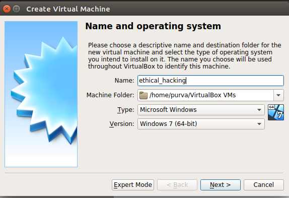

## Step - 3: Select hard-disk file type
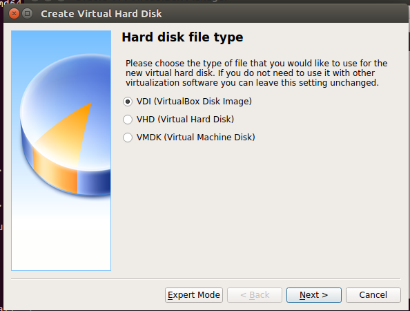

## Step - 4: Select type of storage on your physical hard disk
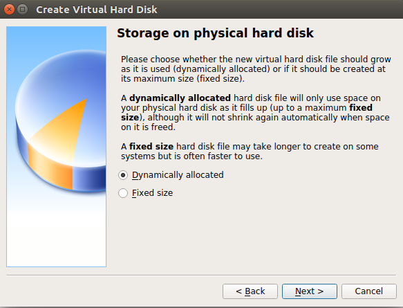

## Step - 5: Now your virtual machine is ready to run
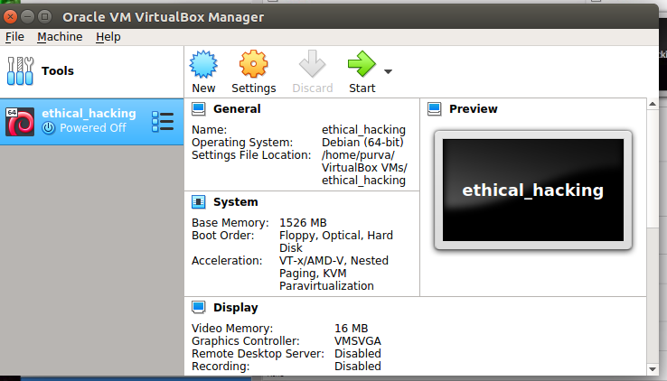

## Step - 6: Goto Settings > Storage
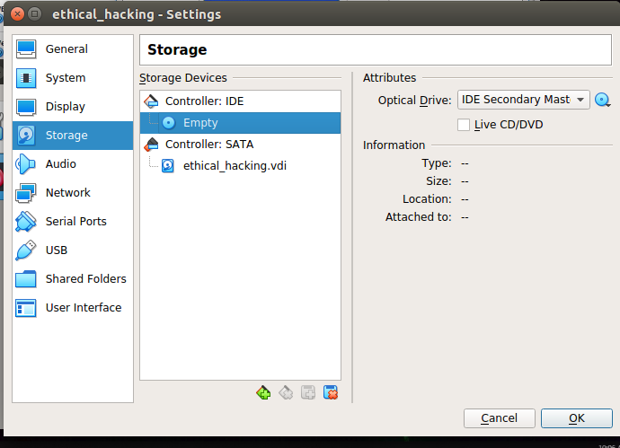

## Step - 7: Replace Empty .iso file with downloaded Kali file


## Step - 8: Start Kali Virtual Machine
*Note : There would be a list of questions that you would have to answer before kali installation begins.*<br>

### Step - 8.1 Click on install kali 
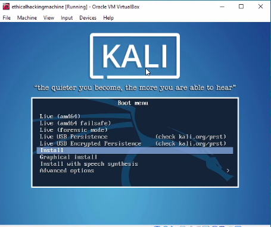

### Step - 8.2 Language Selection
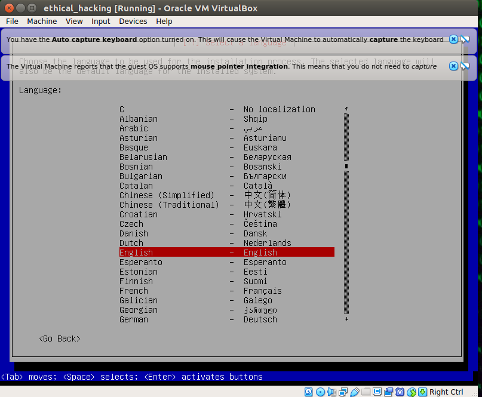

### Step - 8.3 Kali Installation Begins
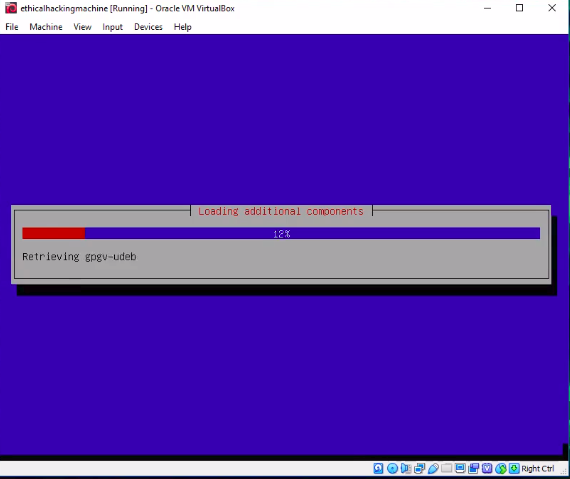

### Step - 8.4 Name Your Kali
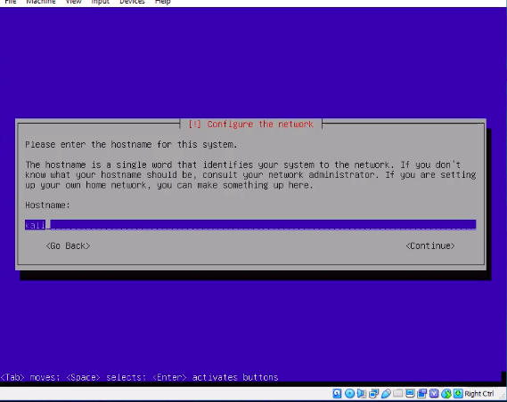

### Step - 8.5 Leave Domain Name Blank
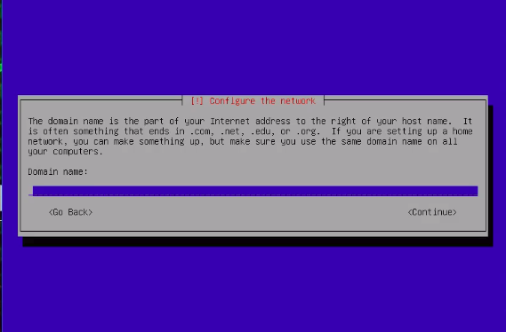

### Step - 8.6 Network Mirror
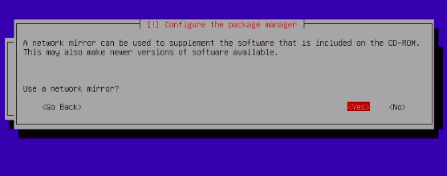

### Step - 8.7 Kali Installation Continues


### Step - 8.8 Set Password
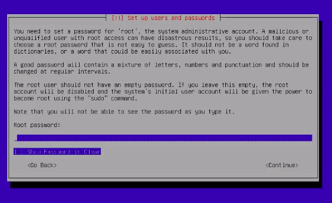

### Step - 8.9 Confirm Password
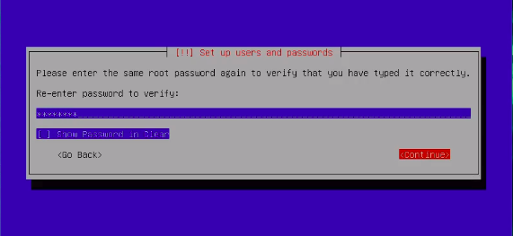

### Step - 8.10 Select Timezone
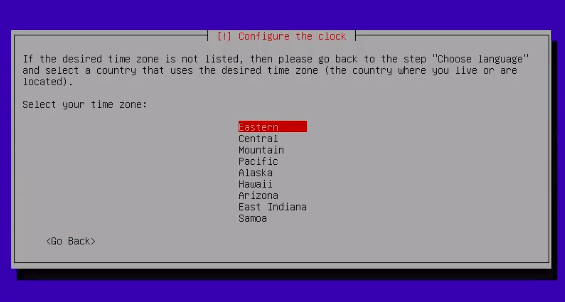

### Step - 8.11 Partition Disk
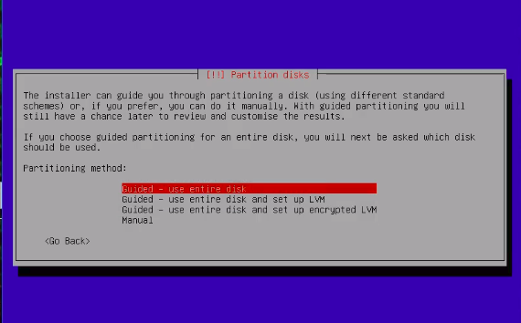
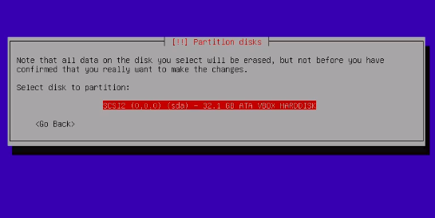

### Step - 8.12 Select Partitioning Scheme
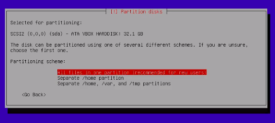

### Step - 8.13 Finish Partitioning
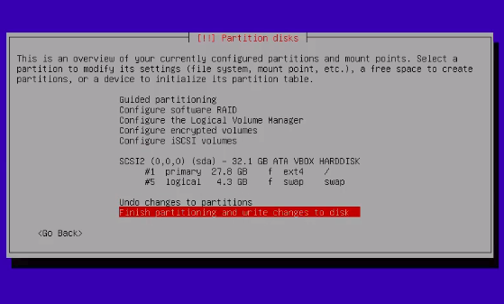

### Step - 8.14 Installation Continues
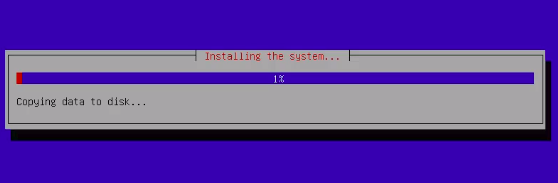

### Step - 8.15 Write Changes to Disk
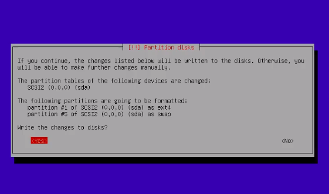

### Step - 8.16 No Proxy
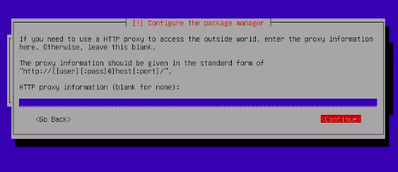

### Step - 8.17 Configuration Begins
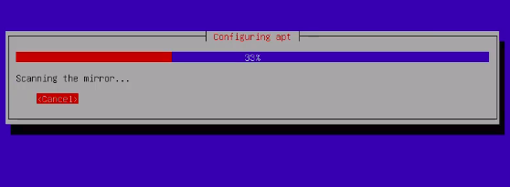

### Step - 8.18 Start Grub Boot Loader


### Step - 8.19 Select device for boot loader installation
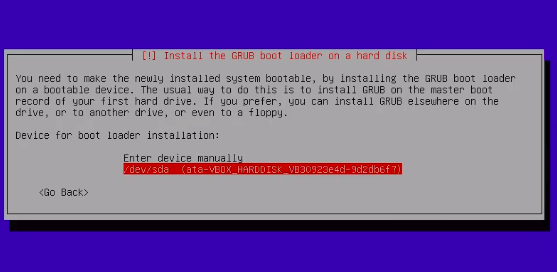

### Step - 8.20 Grub installation complete
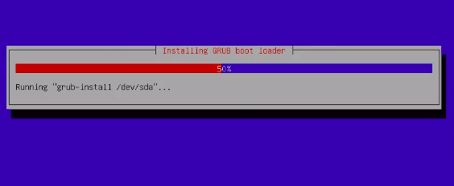

### Step - 8.21 Grub installation complete


### Step - 8.22 Kali installation complete
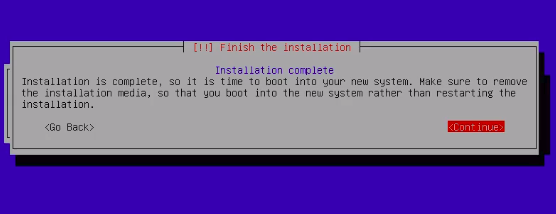


## Step - 9: After successful installation, you would be required to authenticate
*Notes :*<br>
* *You would be asked to create a password for **root** user during installation process.*<br>
* *To login, use username as **root** and your created password.*


## Step - 10: After successful log-in, you should be able to see Kali screen.
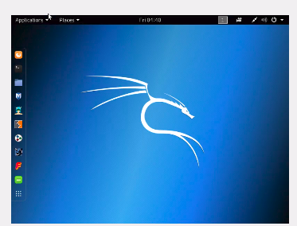
