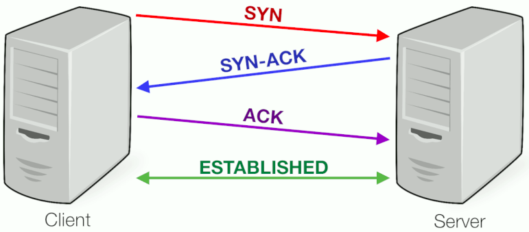

# The three-way handshake 
</img>

# Steps involved in 3-way hand-shake
1. The client first sends a Synchronization packet (SYN).
2. If the server accepts, it responds with a Synchronization Acknowledgment (SYN-ACK) to let the client know it's open and ready for communication.
3. The client responds with an Acknowledgment (ACK). Now the session begins and the socket is created.
