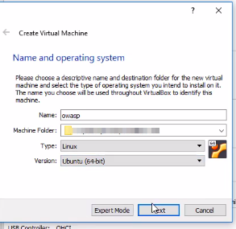
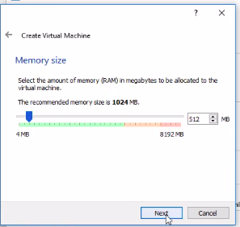
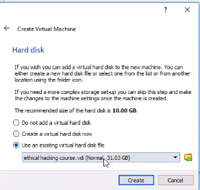
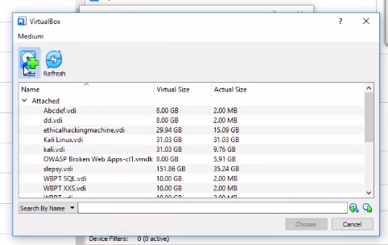
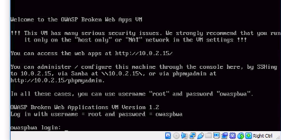
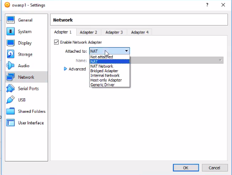
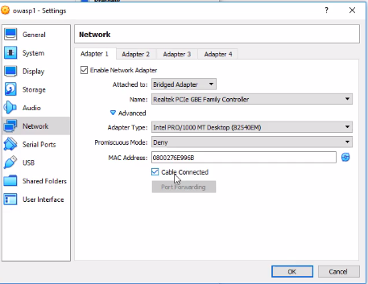
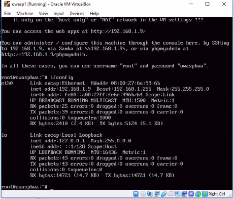
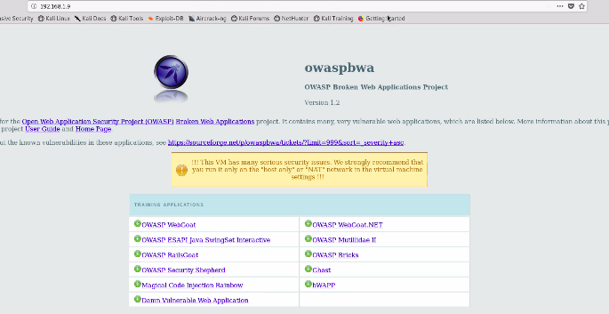

# Installing OWASP (Open Web Application Security Project)

**Step - 1:** Go to Kali's browser and type the following link : `https://sourceforge.net/projects/owaspbwa`<br>
**Step - 2:** Click on **download**.

</img>

**Step - 3: After downloading,you have to extract the following OWASP file** <br>
</img>

**Step - 4: Install OWASP on a virtual machine**<br>
</img><br>

**Step - 4.1: Name the virtual machine**<br>
</img><br>

**Step - 4.2: Allocate memory**<br>
</img><br>

**Step - 4.3: Choose existing hard-disk**<br>
</img><br>

**Step - 4.4: Chose disk from the options**<br>
</img><br>


**Step - 4.5: Chose downloaded OWASP disk**<br>
</img><br>

**Step - 4.6: After starting OWASP virtual machine, OWASP asks for credentials.**<br>
```
enter username = root
enter password = owaspbwa
```
</img><br>

**Step - 4.7: Following are the final settings for OWASP Virtual Machine**<br>
</img><br>
</img><br>

**Step - 4.8:  Run the VM and type `ifconfig` to get the ip address.**<br>
</img><br>

**Step - 4.9: Hit the ip-address in Kal's browser and explore OWASP's options!**<br>
</img><br>

* Hosted link - https://w-cs.000webhostapp.com/bWAPP_latest/bWAPP/portal.php


