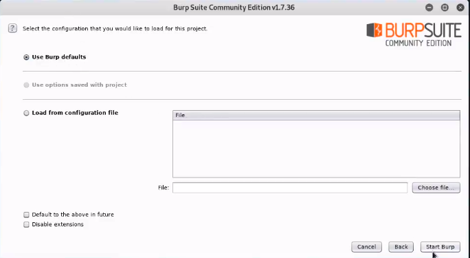
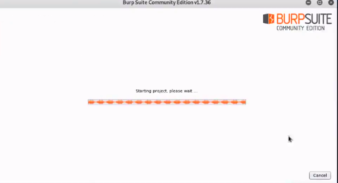
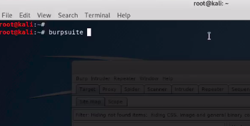
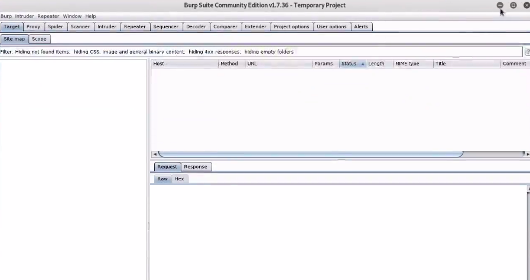

# BurpSuite

# Overview of BurpSuite
* Burp Suite is a graphical tool for **testing Web application security**.
* Using Burp, we can **intercept our own requests** and is **pre-installed in Kali.** 
</img>

# Configuring BurpSuite
##  Step-1 : Open BurpSuite   
</img>
## Step-2 : BurpSuite Starts  
</img>
## Step-3 : Open BurpSuite via Command Line
</img>
## Step-4 : BurpSuite's Home Page
</img>
