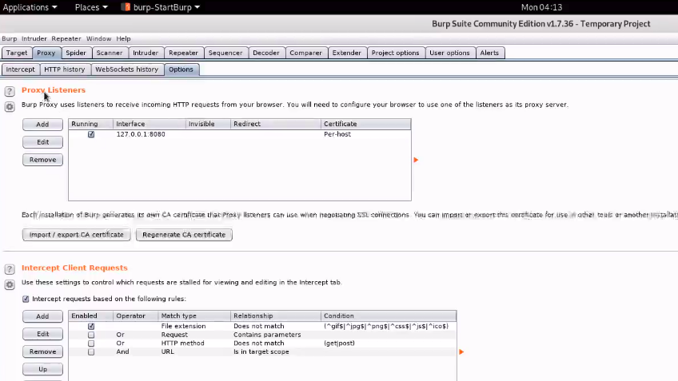
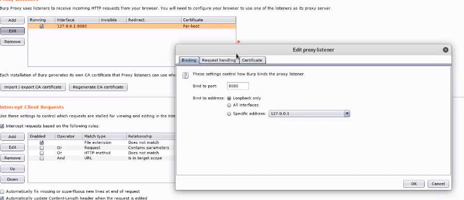
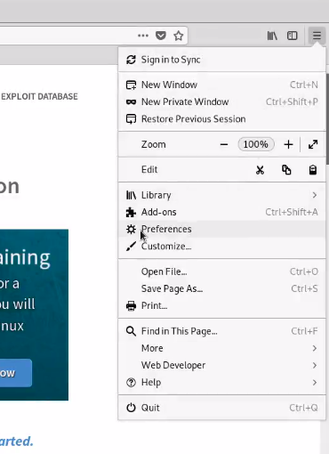
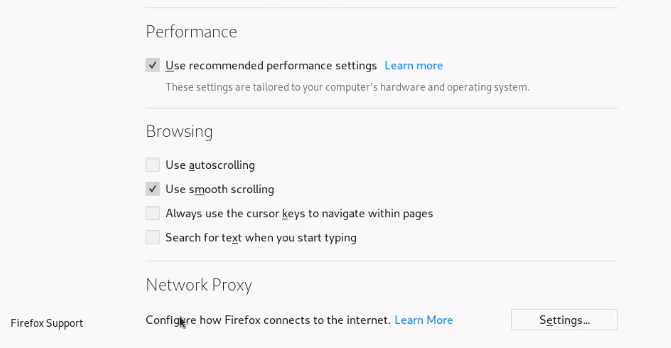
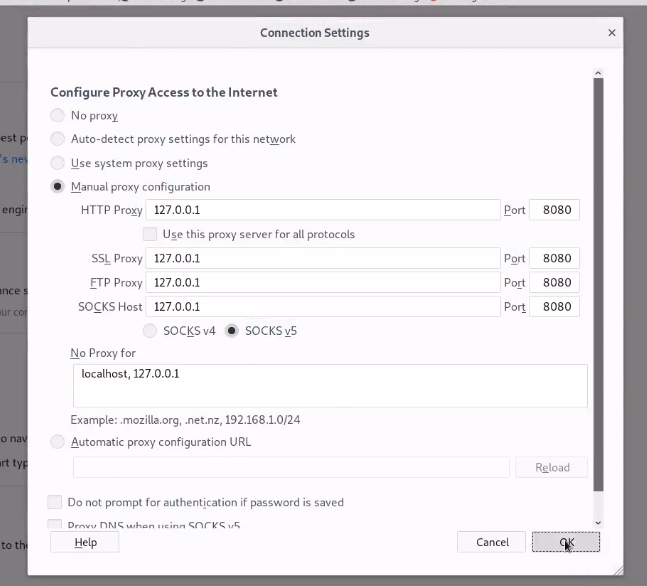
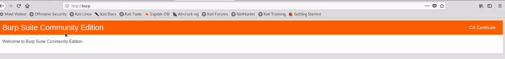

# BurpSuite

# Overview of BurpSuite
* Burp Suite is a graphical tool for **testing Web application security**.
* Using Burp, we can **intercept our own requests** and is **pre-installed in Kali.** 
</img>

# Configuring BurpSuite
##  Step-1 : Open BurpSuite   
</img>
## Step-2 : BurpSuite Starts  
</img>
## Step-3 : Open BurpSuite via Command Line
</img>
## Step-4 : BurpSuite's Home Page
</img>
## Step-5 : Goto Burp, click on proxy >> options
</img>
## Step-6 : Edit proxy ip-address 
</img>
## Step-7 : Edit Mozilla Firefox settings to configure proxy
* Open mozilla firefox in kali.
* Click on preferences. 
</img>
## Step-8 : Scroll down to Network Proxy and select settings
</img>
## Step-9 : Configure firefox settings as below
</img>
## Step-10 :  Add CA certification to access https websites
* Goto http://burp 
</img>
