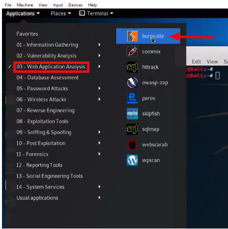

# Configuring BurpSuite

## Overview of BurpSuite
* Burp Suite is a graphical tool for **testing Web application security**.
* Using Burp, we can **intercept our own requests** and is **pre-installed in Kali.** 
</img>
