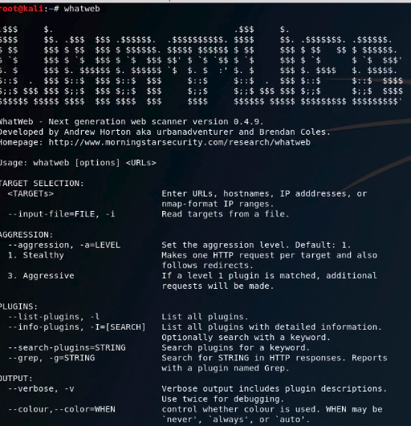
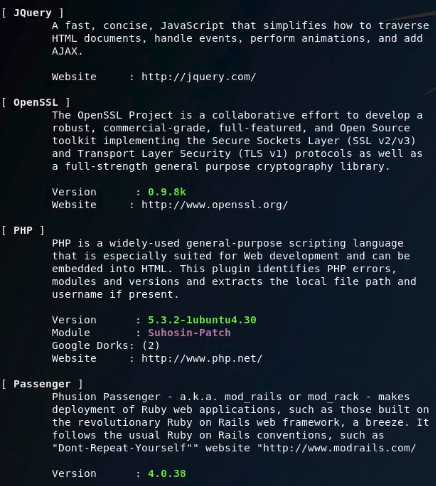
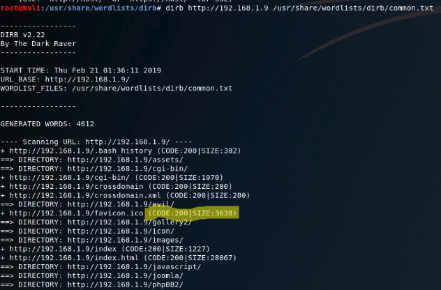

# Whatweb and Dirb

## Whatweb
* `whatweb` command identifies different **web-technologies running on a certain website**.
* Detects **javascript** libraries used for designing websites
* **System technologies** running on website.
* If you type the following command  
`whatweb -v <your-ip-address>`
  * Gives detailed information about things running on website for planning further attack.
* Type the command `whatweb` to find other options you can explore.
</img>
* `verbose` command (`whatweb -v <your ip address>`) would give a list of **technologies running on a particular ip-address** 
</img>
  
  
## Dirb
  * `dirb` scans fr directories that are not found in the page.
  * Tries to find web-pages with different extensions.
  * `dirb` **brute-forces** the website with directories and
      * If status code == 200, print, *page exists*
      * If status code == 404, print, *page doesn't exists*
  * Type the following command to see how `dirb` works: 
    `root@kali:/usr/share/wordlists/dirb# dirb http://<your ip address> /usr/share/wordlists/dirb/common.txt` 
     </img>
  
