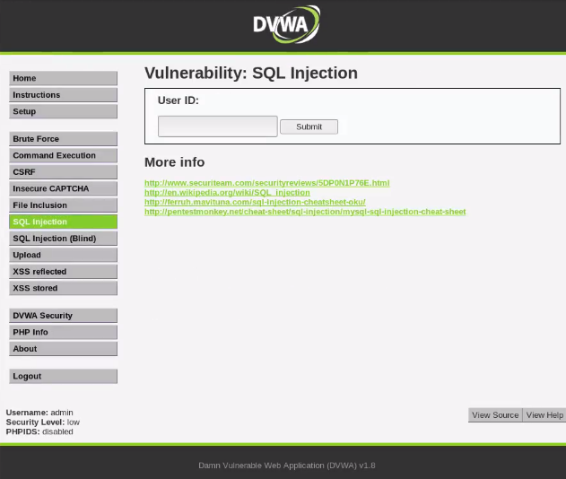
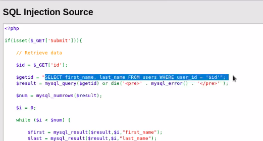
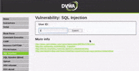
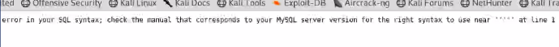

# SQL Injection

## Basic Requirements

* Goto SQL Injection's landing page.<br><br>
</img>
* Click on view-source, to check-out the source-code for the page.<br><br>
</img>
* Type random input to check type of output recieved after submitting.<br><br>
</img>

## Basic Check for SQL Injection

* Basic check to verify whether a server is vulnerable to SQL injection is : single inverted comma.
* A server, vulnerable to SQL inejection would throw the following error if you enter ' as input in text-box:<br><br>
</img>

## Pre-requisites
### Basic My SQL Commands
* You should know basic SQL commands/operations such as SELECT, UNION, ORDER BY, GROUP BY etc. You can read about them - [here](https://dev.mysql.com/doc/refman/8.0/en/sql-syntax.html)

### Commenting in My SQL
* Anything after '#' is considered as a comment in SQL language.

### INFORMATION_SCHEMA.SCHEMATA table
* A schema is a database, so the SCHEMATA table provides information about databases.<br>


| Column name                    | Description                                                                        |
|--------------------------------|------------------------------------------------------------------------------------|
| **CATALOG_NAME**               | The name of the catalog to which the schema belongs.<br> This value is always def. |
| **SCHEMA_NAME**                | The name of the schema.                                                            |
| **DEFAULT_CHARACTER_SET_NAME** | The schema default character set.                                                  |
| **DEFAULT_COLLATION_NAME**     | The schema default collation.                                                      |
| **SQL_PATH**                   | This value is always NULL.                                                         |
| **DEFAULT_ENCRYPTION**         | The schema default encryption.                                                     |


* Syntax:<br>
```
SELECT SCHEMA_NAME AS `Database`
  FROM INFORMATION_SCHEMA.SCHEMATA
  [WHERE SCHEMA_NAME LIKE 'wild']

SHOW DATABASES
  [LIKE 'wild']
```

## Performing SQL Injection
### Step 1: Finding database related to users.
* We want to find out name of database and name of users attached to that database.
* Functions to use : `database()` and `user()` 
* Type the following command to print database used:<br>
`2'UNION SELECT database(), user() # `
