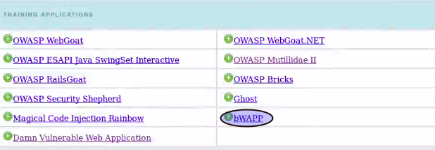
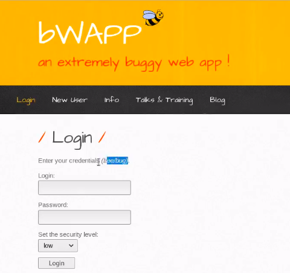
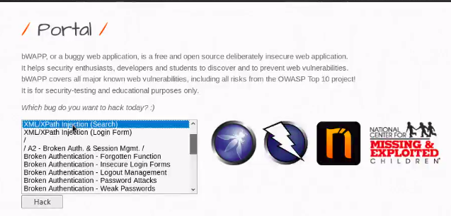
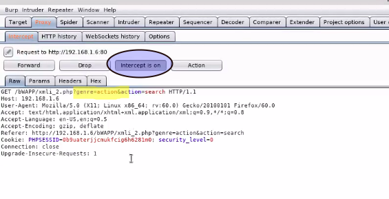
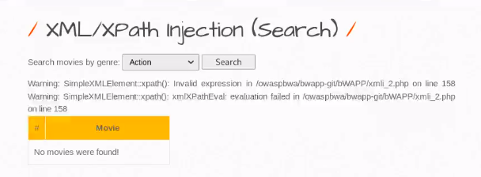
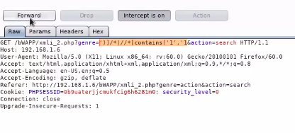
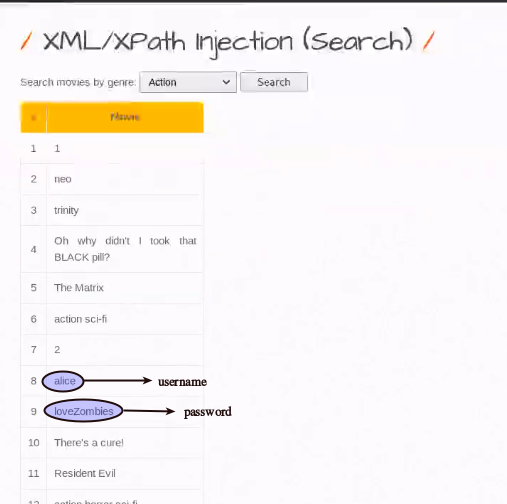

# XML Injection

# Steps to perform XML injection in OWASP

## Step 1: Open bWAPP
* Goto OWASP's landing page and click on bwapp.<br><br>
</img>

## Step 2: Enter Credentials 
* You can either use brute-force or directly enter credentials to enter login-page.<br><br>
</img>

## Step 3: Select XML/XPath Injection (search) 
* After logging in, search for XML/XPath injection option.<br><br>
</img>

## Step 4: Open BurpSuite and switch on the intercept 
* Edit the parameter **genre**, since it captures the user input,to perform XML injection <br><br>
</img>

## Step 5: Testing if server is vulnerable to XML injection
* In the parameter **genre**, add an apostrophe; for ex: `genre=action'` to check XML injection vulnerability. 
* If you get the following error as below, the server is vulnerable to XML injection<br><br>
</img>

## Step 6: Entering command to perform XML injection 
Enter the following regex, to perform XML injection:<br>
```
genre=')]/*|//*[contains('1','1
```
<br>
</img><br>

## Step 7: Extract passwords
</img>
