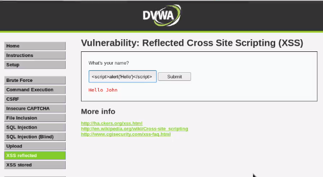
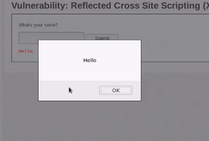

# XSS Injection
 XSS injection allows you to play with dynamic elements for. ex. search fields, hyperlinks, forms, video, audio-controls etc. The back-end code would also contain scripting code, for.ex. javascript, which is used to make any website more dynamic, which in-turn can be used to perfom  cross-site scripting attacks.<br>
 For. ex. user enter input as green and back-ground of website turns green
 
 ### 4 Players of XSS Injection
 * xss attacker that performs the attack
 * vulnerable web application
 * victim that uses web-browser
 * some website that attacker wants the victim to redirect to
 
 # Reflected XSS
 * Go back to OWASP, then [DVWA](https://github.com/purvasingh96/FSociety/blob/a245fda025614e7f640593549ac499841badb90e/Web%20Application%20Penetration%20Testing/Injection%20Attacks/Command%20Injection/Readme.md).
 * Enter the following javascript code in the input box to check the results.<br>
 ```javascript
 <script>alert('hello')</script>
 ```
 ## DVWA Landing Page
 </img><br>
 
 ## XSS Injection's Output
  </img><br>
 
 # Stored XSS
 * For performing stored-xss attack, migrate to **wacko-picko** in OWASP.
 * Migrate to **guestbook** section and fill the detials.
 * In place of comments section, you can type any javascript code. For. ex.
 
 * Every time you visit the vulnerable page, you would be prompted with **hello alert message**
 * This is an example of **stored xss attack**, more dangerous than reflected xss.
 * In reflected xss, we would have to send the malacious link to the user, so that user **redirects himself to vulnerable webiste.**
