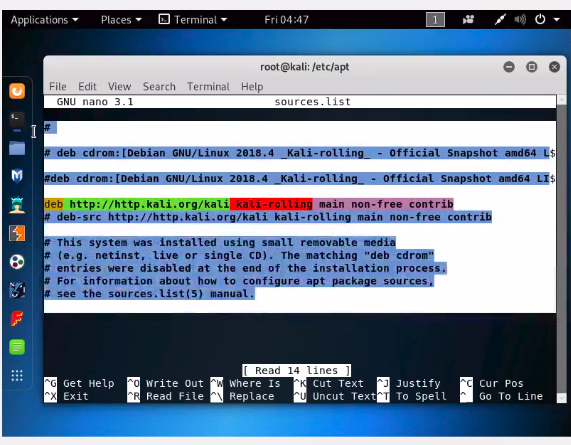
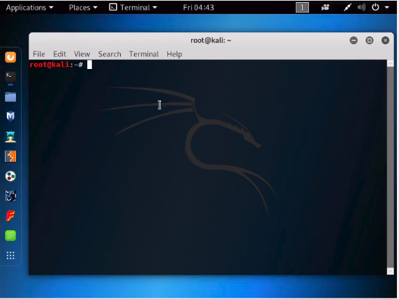
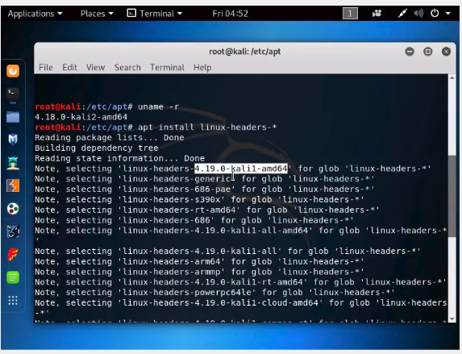
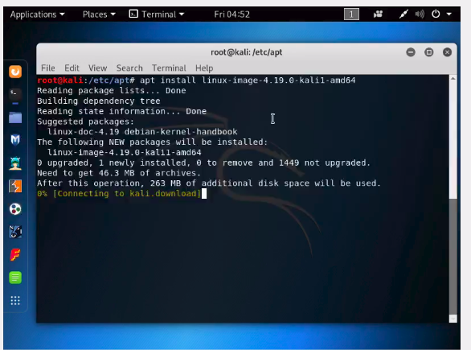
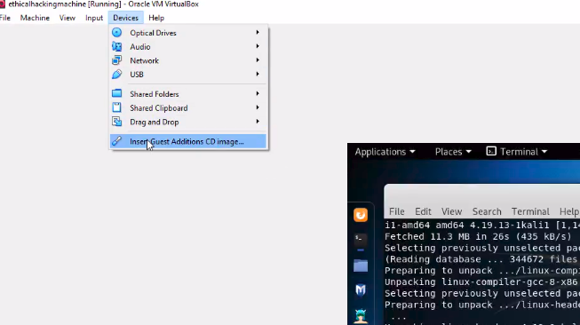
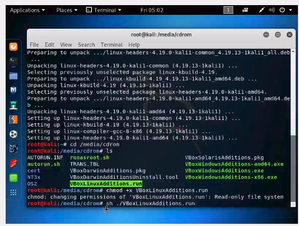
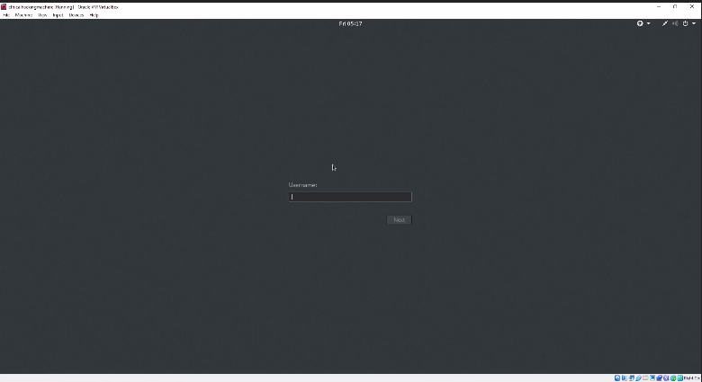

# Steps to make Kali linux in full screen mode

# Step - 1: Identifying kali linux's icons
* First icon on the left is **firefox**
* Second icon on the left is **terminal**


# Step - 2: Open Kali's Firefox
* Open **firefox**
* Search for [Kali linux source's list repository]( https://docs.kali.org/general-use/kali-linux-sources-list-repositories)
* Under **Source Repository** copy the command - <br>
```deb-src http://http.kali.org/kali kali-rolling main non-free contrib```



# Step -3: Open Kali's Terminal

* *Note* - *If for some reason, you don't see terminal icon in kali's home screen, open **files (third icon on the left)** and right click. Choose **Open with terminal** option.*


* In format **root@kali**, *root* is the username, *kali* is the hostname.
* Type the following commands -
```
cd etc/apt
nano sources.list
```
* Press **Ctrl+O** (save the content), then **Ctrl+Y** (close after saving)

```
apt update
uname -r
```
* command `uname -r` will give the **latest kali version** running on your VM.

```
apt install linux-headers-*
```
* When terminal asks -> do you want to continue? -> **hit no**.
* Copy the first line, where you can see **latest Kali version**.


```
apt install linux-image-<latest-kali-version>
reboot
apt install linux-headers-$(uname -r)
```
* When terminal asks -> do you want to continue? -> **hit yes**.



* Next, click on **devices** > **Insert guest additions CD image**.


```
cd /media/cdrom
chmod +x VBoxLinuxAdditions.run
sh ./VBoxLinuxAdditions.run
```




* Now, you should be able to view **kali linux in full screen mode**.




